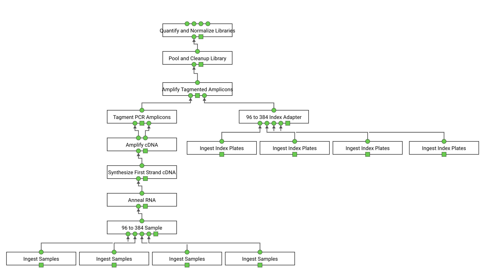
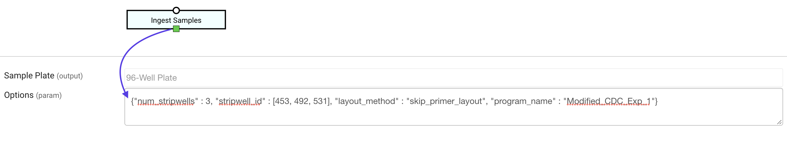

# Genome Center Protocols

## General Discussion
These protocols were developed for the [Duke Genomics Core](https://genome.duke.edu/cores-and-services/sequencing-and-genomic-technologies) covid sequencing project.  This project was in response to the COVID-19 pandemic.  Duke University required a way to rapidly test the entire school population at regular intervals.  They showed that using an NGS based approach was capable of very accurate high throughput sequencing.  The proposed workflow would work on 384 well plates with up to 10 patient samples per well for a total of 3,840 patient samples per run.  An added benefit of an NGS approach is full genome sequencing where they could monitor variant transmission through a target population.  Reference **EXTERNAL DOCUMENT** for more detail on NGS approach.

The Aquarium team sought to address two challenges to such an approach:

- This NGS workflow required complex steps that included multiple different liquid handling robots along with detailed manual steps.  A solution was required to decrease technician error, increase technician speed, and decrease technician training.

- High throughput NGS workflows include complex pooling of samples.  Accurate meta-data is required to deconvolve these pools.

Aquarium protocols automatically track samples throughout complex reactions enabling hands off meta-data collection.  This can greatly decrease technician work load while increasing meta-data accuracy.  Aquarium protocols also provide real-time instructions to technicians for human in the loop automation **(reference aquarium paper or other)**.  These instructions provide dynamic instructions to technicians allowing them to focus on their current task without worrying about missing steps, using the wrong reagents, or other common laboratory concerns.

---
### Liquid Handling Robots
The largest challenge in developing these protocols was the integration of [Liquid Handling Robots](https://github.com/aquariumbio/aq-liquid-handling-robots).  Although Aquarium protocols have successfully been deployed for many workflows, these protocols pioneered Aquarium - Robot interactions.

Most simple pieces of laboratory equipment operate in relatively standard ways regardless of manufacturer.  Any competent laboratory technician can reasonable be expected to know how to operate most centrifuges, pipettors, etc.  Even most thermocyclers operate in fairly basic/similar ways.  In these cases simply providing parameters (e.g. centrifuge time and spindle speed, or thermocycler times and temperatures) is all that is required.

Liquid handling robots however, vary drastically even within a single manufacturer.  Different models have drastically different capabilities with respect to pipette tips, plate slots, software, and more.  In the past, protocols have solved this type of problem by largely ignoring the issue.  Either by specifying single compatible robot or by being sufficiently vague such that any robot would "fit".  This was simply not acceptable for this project, we needed specific information while retaining the ability to interchange robots.

Although not perfect the [Liquid Handling Robots](https://github.com/aquariumbio/aq-liquid-handling-robots) libraries sufficiently address this design challenge.  These protocols demonstrate what is the current standard for Aquarium-Robot interactions and how the [Liquid Handling Robots](https://github.com/aquariumbio/aq-liquid-handling-robots) should be used.

In general the protocol has no knowledge of how a robot works.  The protocol is simply given the desired robot-class and the applicable robot-program.  The protocol then asks the robot-class to perform the program.  The robot-class then provides the protocol with a list of steps for the technician to perform.  This enables any Robot to be integrated into a protocol as long as a compatible robot-program and robot-class exists.  Reference [Liquid Handling Robots](https://github.com/aquariumbio/aq-liquid-handling-robots) for more detailed information on creating new robot-programs and robot-classes.

Although robust, these libraries do not make robots completely interchangeable.  When using multiple robots it is still important to ensure that any test tubes or plates are compatible with the desired equipment.  Additionally it is important to make sure that the desired robot can perform the task required.

---
### Composition Libraries
Development of [Composition Libs](https://github.com/aquariumbio/protocol-base/tree/main/composition_libs) and [Consumable Libs](https://github.com/aquariumbio/protocol-base/tree/main/consumable_libs/libraries) was also critical in this workflow.  These libraries enable quick and easy adjustments to all critical parts of an assay.  Because of these features every protocol should utilize these libraries.

The Genome Center Protocols use a large number of reagents.  Furthermore the reagent mixes were not fully established when the protocols were first written.  The [Composition Libs](https://github.com/aquariumbio/protocol-base/tree/main/composition_libs) enabled us to quickly change volumes, master mix compositions, and any reagent identities without re-writing the protocol.

An added benefit was the easy integration of [Kits](https://github.com/aquariumbio/protocol-base/tree/main/composition_libs) (reference README for details on kit integration) into reagent mixes.  It is laborious to ingest every part of a kit into Aquarium.  These libraries enable kits to operate under a single Item ID differentiated by the colloquial name of the components within the kit.  This enables a technician to grab a single kit and use the parts within that kit in a very natural manner.  Furthermore these libraries enable simple kit volume tracking so that the protocol will always find a kit that has enough remaining reactions to complete the protocol at hand.  This last feature is critical in a production application where many kits of the same type may be in inventory.

---
### Liquid Handling Robots
Although more simple than Liquid Handling Robots, we found that RT-qPCR presented similar challenges.  We developed both the [Thermocyler libraries](https://github.com/aquariumbio/thermocyclers) and [PCR Models](https://github.com/aquariumbio/pcr-models) to assist in handling any PCR needs.

These protocols demonstrate a range of ways that these libraries can be employed.

---
### Provenance Finder
Another unique tool developed for these protocols is the [Standard Libs/ProvenanceFinder](https://github.com/aquariumbio/protocol-base/tree/main/standard_libs/libraries) which enables operations to search item provenance and retreive data recorded in past protocols.  This is seen in [Quantify and Normalize Libraries](https://github.com/aquariumbio/aq-genome-center/tree/master/covid_surveillance/operation_types/quantify_and_normalize_libraries).

---
## Sample Flow

This protocol followed variations of the [QIAamp 96 Viral RNA Extraction](https://www.qiagen.com/us/resources/resourcedetail?id=839ac3cc-798a-49a9-ab2a-7872fcd18284&lang=en) and the [Illumina COVIDseq Test](https://support.illumina.com/content/dam/illumina-support/documents/documentation/chemistry_documentation/Illumina-COVIDSeq-Test/illumina-covidseq-test-reference-guide-ruo-1000000126053-04.pdf).

The Aquarium workflow broke into 11 separate protocols as show below.

NOTES:
- Safe stopping points are explicitly noted.  The end of a protocol does **NOT** indicate a safe stopping point.

- These protocols were largely separated by Thermocycler steps, where the technician may receive a brief respite.  These steps largely follow the sections listed in the [QIAamp 96 Viral RNA Extraction](https://www.qiagen.com/us/resources/resourcedetail?id=839ac3cc-798a-49a9-ab2a-7872fcd18284&lang=en) and [Illumina COVIDseq Test](https://support.illumina.com/content/dam/illumina-support/documents/documentation/chemistry_documentation/Illumina-COVIDSeq-Test/illumina-covidseq-test-reference-guide-ruo-1000000126053-04.pdf) workflows.

- These protocols were designed for 384 well plates however can be adapted for use with any size plates by simply changing I/O Object Types.  With minor changes these protocols should be able to work with individual sample tubes.

- Because of the high throughput nature of these protocols it is not recommended to batch protocols that are not part of the same plan.  Batching is possible but may be complex, additional testing and forethought may be required if batching is desired.

### General Overview
Incoming patient samples are loaded onto 96-Well Tube Racks barcode scanned and a CSV is created.  These 96-Well Tube Rack are then ingested into Aquarium.  The CSV's generated from the barcode scanner provides Aquarium with all required starting meta data.

These 96-Well Tube Racks are then combined into a 384-Well Plate.  These plates then go through RNA extraction, cDNA synthesis, and are tagged with with unique Index Adapters.

After Tagmentation the samples are pooled together into a single library and sequenced.

Metadata from Aquarium and raw data from the sequencer are then uploaded to an analysis pipeline for complete analysis.  Because sequencer data can be quite large these data are not directly uploaded to Aquarium.

___

### Detailed Protocol Overview

Note:

This workflow was specifically designed with the Dragonfly and Mosquito Liquid Handling robots in mind.  These robots can, however, be replaced with any equivalent Liquid Handling Robot.  You must ensure that proper robot models exist for your desired robot.  Reference [Liquid Handling Robot](https://github.com/aquariumbio/aq-liquid-handling-robots) libraries for more information.

Square boxes indicate JSON option input.  These options are intended for expert users only and vary from protocol to protocol.  Reference **default_job_params** and **default_operation_params** for possible options.

For more information on how to create plans in Aquarium please reference [AquariumBIO](https://www.aquarium.bio/).

This workflow deviates somewhat from the common Aquarium I/O standard.  Primarily Aquarium is not built to work with plates as a whole.  Rather it is designed to used specific wells of a plate individually.  This means that each I/O is designed to point at exactly one well of a plate.  To refer to an entire plate we could have an I/O for each individual well.  Needless to say this is simply impractical.  Instead it is assumed (for these protocols) that whenever any single well of a plate is is an I/O the entire plate is the I/O.  This means that if you want to point to an entire plate you need to specify exactly one well from that plate.

This is very simple from a coding perspective however can be a little un-intuitive when designing plans especially when specifying Outputs.  Outputs samples should be some generic Sample (e.g. Pooled Library) that all individual wells of a plate fit under.   The connection from individual Items and their original Patient Sample can be deconvolved later during analysis using Aquarium Generated meta-data.

[Ingest Sample](https://github.com/aquariumbio/aq-genome-center/tree/master/covid_surveillance/operation_types/ingest_samples) takes a 96-Well Plate of Patient samples, ingests them into Aquarium, and instructs technician to label 96-Well plate with appropriate Aquarium ID.  Requires CSV upload format in [Example Sample Ingest CSV](:csv:/ExampleSampleIngest.csv).
- input: None
- Output: 96-Well Sample Plate
- Other: [CSV](:csv:/ExampleSampleIngest.csv) required

[Ingest Index Plate](https://github.com/aquariumbio/aq-genome-center/tree/master/covid_surveillance/operation_types/ingest_index_plates) takes a 96-Well Plate of Index Adapters, ingests them into Aquarium, and instructs technician to label 96-Well plate with appropriate Aquarium ID.  Requires CSV upload format in [Example Index CSV](:csv:/IndexPlate1.csv).  Each index adapter plate should last multiple runs so this protocol should only be run "as needed".
- input: None
- Output: 96-Well Index Adapter Plate
- Other: [CSV](:csv:/IndexPlate1.csv) required

[96 to 384 Sample](https://github.com/aquariumbio/aq-genome-center/tree/master/covid_surveillance/operation_types/_96_to_384_sample) takes up to 4 96 well plates and uses a Robot to transfer these into a 384 well plate.  Each plate fills one quadrant of the 384 well plate.
- input: 4 x 94-Well Sample Plate
- Output: 384-Well Sample Plate

[96 to 384 Index Adapter](https://github.com/aquariumbio/aq-genome-center/tree/master/covid_surveillance/operation_types/_96_to_384_index_adapter) takes up to 4 96 well plates and uses a Robot to transfer these into a 384 well plate.  Each plate fills one quadrant of the 384 well plate.  Each index adapter plate should last multiple runs so this protocol should only be run "as needed".
- input: 4 x 94-Well Index Adapter Plate
- Output: 384-Well Index Adapter Plate

[Anneal RNA](https://github.com/aquariumbio/aq-genome-center/tree/master/covid_surveillance/operation_types/anneal_rna) takes 384-Well plate of samples. Has technician label a new 384-Well Plate, load reagents, sample plate, and new plate onto liquid handling robot.  Has technician load proper robot protocols and run thermocycler.
- input: 384-Well Sample Plate
- Output: 384-Well Sample Plate

[Synthesize First Strand cDNA](https://github.com/aquariumbio/aq-genome-center/tree/master/covid_surveillance/operation_types/synthesize_first_strand_cdna) walks technician through reverse transcription and creation of cDNA.  It takes 384-Well plate of samples. Technician will load reagents, sample plate, and new plate onto liquid handling robot.  Has technician load proper robot protocols and run thermocycler.
- input: 384-Well Sample Plate
- Output: 384-Well Sample Plate

[Amplify CDNA](https://github.com/aquariumbio/aq-genome-center/tree/master/covid_surveillance/operation_types/amplify_cdna) walks technician through cDNA amplification.  It takes 384-Well plate of samples.  Has technician label two new 384-Well Plates (COV1, COV2) one plate for each Primer Pool.  Technician will load reagents, sample plate, and new plates onto liquid handling robot.  Has technician load proper robot protocols and run thermocycler.
- input: 384-Well Sample Plate
- Output: 2 x 384-Well Sample Plate (COV1, COV2)

[Tagment PCR Amplicons](https://github.com/aquariumbio/aq-genome-center/tree/master/covid_surveillance/operation_types/tagment_pcr_amplicons) walks technician through Tagmentation.  It takes two 384-Well plate of samples (COV1, COV2).  Has technician label new 384-Well Plates.  Technician will load reagents, sample plate, and new plates onto liquid handling robots.  Has technician load proper robot protocols and run thermocycler.  Both COV1 and COV2 plates will be combined into new plate.
- input: 2 x 384-Well Sample Plate (COV1, COV2)
- Output: 384-Well Sample Plate

[**Critical Step**: 
Amplify Tagmented Amplicons](https://github.com/aquariumbio/aq-genome-center/tree/master/covid_surveillance/operation_types/amplify_tagmented_amplicons) walks technician amplification and addition of index adapters.  This step is critical for meta-data, index adapters enable de-convolution of the library pool.  If this protocol has errors be very sure that provenance is recorded.  This protocol has technician label new 384-Well Plates.  Technician will load reagents, sample plate, and new plates onto liquid handling robots.  Has technician load proper robot protocols and run thermocycler.
- input: 384-Well Sample Plate
- input: 384-Well Index Adapter Plate
- Output: 384-Well Sample Plate

[Pool and Cleanup Libraries](https://github.com/aquariumbio/aq-genome-center/tree/master/covid_surveillance/operation_types/pool_and_cleanup_library) walks technicians through library pooling steps.  All samples will be combined into a single test tube.
- input: 384-Well Sample Plate
- output: Pooled Library

[Quantify and Normalize Libraries](https://github.com/aquariumbio/aq-genome-center/tree/master/covid_surveillance/operation_types/quantify_and_normalize_libraries) walks technician through library normalization.  Has technician measure library concentration and perform dilutions.  Protocol will perform calculations for technician however care must be take to ensure measurements are correct.  Finally the protocol will provide the technician with CSV output that is critical for library sequencing.  Technician is expected to download CSV for later use.
- input: Pooled Library
- output: Normalized Libraries
- Other: output CSV
